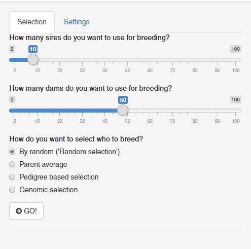
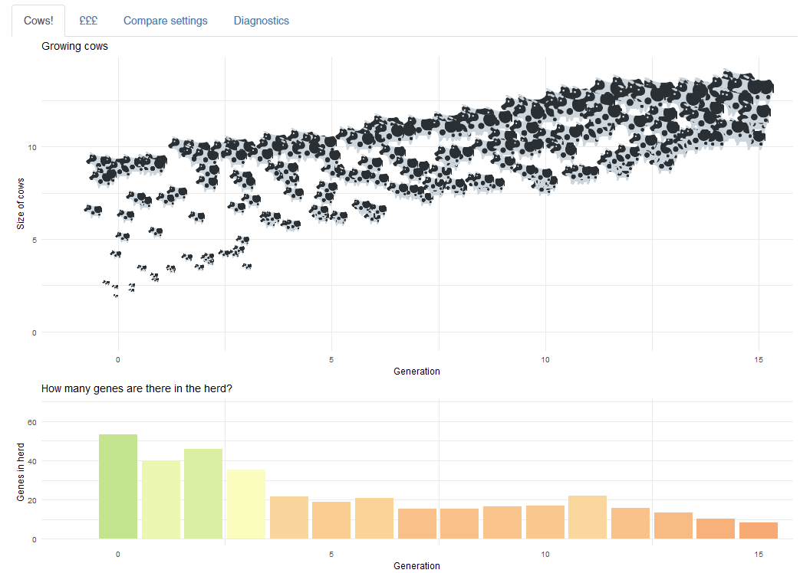
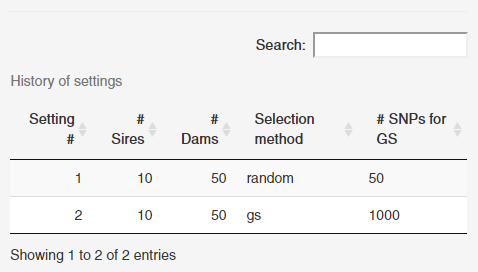
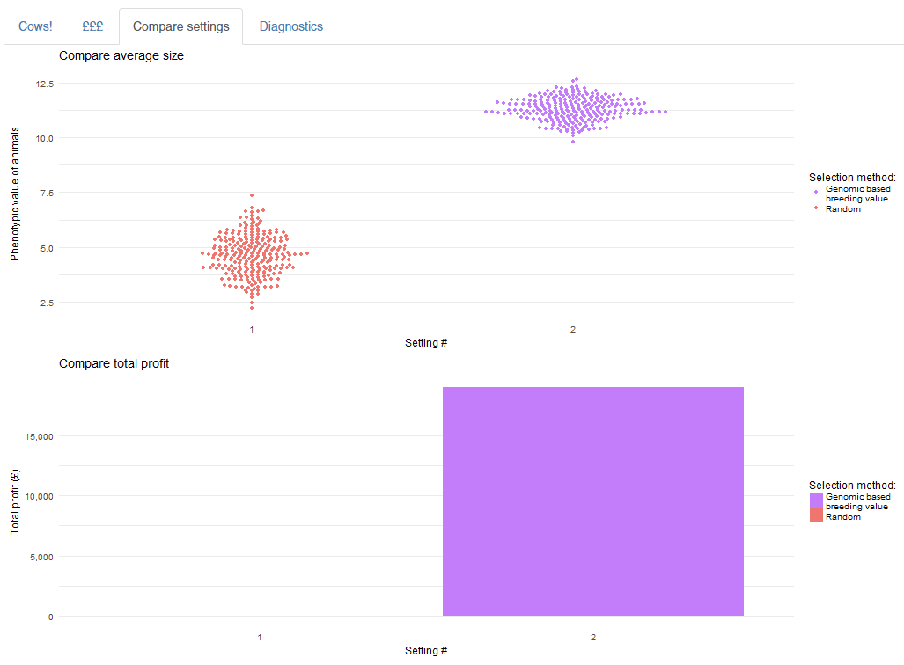

This repository contains two Shiny apps, designed for demonstrating 
how different technologies may be applied for selection in cattle.

The two folders present, `compare-selection` and `change-selection` are very similar in design.
See the following descriptions for them.

The power house of these apps is '[AlphaSimR](https://bitbucket.org/hickeyjohnteam/alphasimr)',
an R-package designed for simulating both animal and plant breeding, using
Mendelian inheritance of realistic chromosomes.


**NB!** The breeding games were developed using AlphaSimR v. **0.3.1**.
The most likely commit for this version is `3d8ea94` from [2017-09-13](https://bitbucket.org/hickeyjohnteam/alphasimr/commits/3d8ea94461e4a297a383bb666dcaebc668d34006).
Later versions of AlphaSimR might not be backward-compatible with these apps.

## Compare Selection

Breed your cattle heard for 15 generations using on of several choices for selection:

* Phenotypic truncation selection
* Parent average
* Genomic selection using 50, 250, or 1000 SNP genotyping panels.

Try to increase your cattle's size while keeping it with a healthy proportion of 
genomic variance. 
The genomic variance is displayed as 'number of genes' in the herd to make the concept more
palatable for younger audiences. Strictly speaking, it is the genetic variance times 1,000.

The app allows the user to compare different selection choices and selection intensities,
and compares them on phenotypic value and cost/profit.


### How to start

Run `run_once.R` just once to install required packages and generate the base population
which all simulations are based on.

File `run.R` contains the few lines required to start the Shiny app locally.

File `global.R` contains the parameters for the game; cost of the selection choices, 
profit from selling cattle, etc.

### How to use

The screen is divided in two side, left with options for setting and selecting strategies,
and right for results.



The user must start with adjusting the options for a selection. 
From top to bottom, how many sires and dams to keep for breeding, and how to 
calculate breeding values.
The sires and dams used for breeding are not sold, and thus cost the breeder to keep.

When the user has set the setting, press the button 'GO!'.

The result of the breeding is displayed on the right-hand side:



The main plot shows a subset of the cattle in the herd, with the size of the cow
proportional to their value.
The subset is selected as the best 3, worst 3, and a random sample. 

The bottom plot displays the genetic variance available in the herd. 
If the value falls below 20, the herd cannot survive.

Once a strategy has been simulated, an overview of all scenarios is available to 
the user, below the 'GO!' button:



Click any of these to retrieve the previous simulation.

The outcome of all scenarios can be compared under the 'Compare settings'-tab:



## Change selection

This app allows the user to change selection strategy during breeding.
Its setup is very similar to **Compare selection** described above.


## FAQ


If you get the error

```
Error in shinyAppDir(x) : App dir must contain either app.R or server.R.
```

change working directory to the directory containing the files `ui.R` and `server.R`.